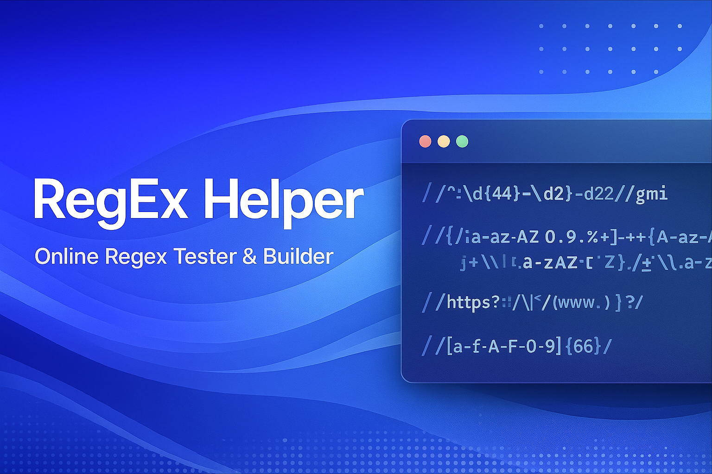

# 📘 RegEx Helper  
### Online Regex Tester & Builder



## 🚀 Overview

**RegEx Helper** is a modern web application built with **Next.js 14**, **TypeScript**, **Tailwind CSS**, and **shadcn/ui**.  
It provides a clean and interactive environment for testing, analyzing, building, and understanding Regular Expressions.

- 🔍 Test regex patterns against text  
- 🧩 View matches with detailed metadata  
- 🎨 Highlight matches inside the full text  
- 📚 Use a built-in pattern library  
- 🧠 Get auto-generated explanations for each token  
- 🌙 Light/Dark mode support  
- ⚡ Instant feedback with debounced inputs  

---

## ✨ Features

### 🔤 Regex Input  
- Write any RegEx pattern  
- Enable/disable flags: `g`, `i`, `m`, `s`, `u`, `y`  
- Monospace editor for clarity  

### 🧪 Test Text  
- Enter any sample text  
- Auto line/character counter  
- Realtime evaluation  

### 🎯 Match Results  
- Shows:
  - Match index  
  - Value  
  - Start/end offsets  
  - Captured groups  

### 🖍️ Highlighted Output  
- Displays the text with visual highlights for each match  

### 📚 Pattern Library  
Includes common patterns like:

- Email  
- URL  
- Phone  
- Username  
- Strong Password  
- Hex Color  
- HTML Tag  
- IPv4  
- Date (YYYY-MM-DD)  
- Credit Card  

Each item includes:
- Pattern  
- Description  
- “Use Pattern” button  
- “Copy” button  

### 🧠 Regex Explanation  
Breaks down the pattern token-by-token and provides human-readable descriptions for:

- Character classes  
- Groups  
- Quantifiers  
- Escapes  
- Literals  

---

## 🛠️ Tech Stack

- **Next.js 14 (App Router)**
- **React 18**
- **TypeScript**
- **Tailwind CSS**
- **shadcn/ui**
- **lucide-react**
- **sonner**
- **next-themes**
- Deployed with **Vercel**

---

## ⚙️ Installation

```bash
git clone https://github.com/mahmoudalshukri/regex-helper
cd regex-helper
npm install
npm run dev
```

---

Your app will be available at:
```bash
http://localhost:3000
```

⭐ Support the Project
If you like this tool, consider giving it a ⭐ Star on GitHub!

📬 Contact
Mahmoud Alshukri
Full-Stack Developer
Feel free to reach out for suggestions, issues, or improvements.
